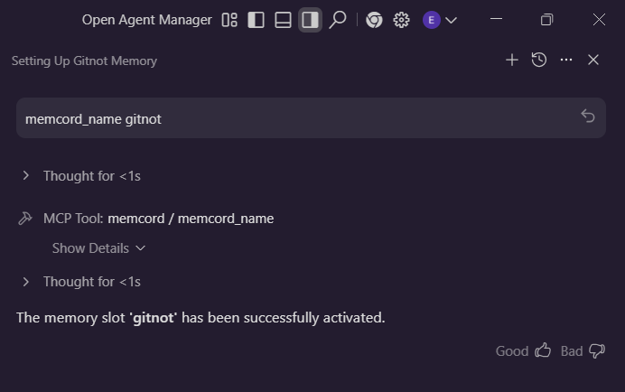

<table>
  <tr>
    <td>
      
    </td>
    <td>
      <h3>MEMCORD v2.4.0 (mcp server)</h3>
      <p>
        This privacy-first, self-hosted MCP server helps you organize chat history, summarize messages, search across past chats with AI — and keeps everything secure and fully under your control.
      </p>
    </td>
  </tr>
</table>

[](https://github.com/modelcontextprotocol)
  [](https://docs.anthropic.com/claude/docs/claude-code)
  [](https://claude.ai/desktop)
  [](https://code.visualstudio.com/)
  [](https://antigravity.google)
  [](https://python.org)
  [](LICENSE)
  [](https://buymeacoffee.com/ukkit)

### Never Lose Context Again

Transform your Claude conversations into a searchable, organized knowledge base that grows with you

## ✨ Core Benefits

* **🧠 Infinite Memory** - Claude remembers everything across unlimited conversations with intelligent auto-summarization
* **🔒 Your Data, Your Control** - 100% local storage with zero cloud dependencies or privacy concerns
* **🎯 Effortless Organization** - Smart tags and folders that organize themselves around your workflow
* **🔗 Intelligent Merging** - Automatically combines related conversations while eliminating duplicates

## What's new in v2.4.0

```text
Project Memory Binding & Auto-Detection for ⭐claude code⭐:

  - New memcord_bind tool: Bind project directories to memory slots via .memcord file
  - New memcord_unbind tool: Remove project bindings (preserves memory data)
  - Auto-detection: Slash commands automatically use bound slot from .memcord file
  - Zero-config workflow: Once bound, no need to specify slot names
  - Updated tool count: 21 tools (13 basic + 8 advanced)
  - Enhanced documentation for project binding workflows
```

check out [🔗 Project Setup Workflow](#-project-setup-workflow) section for details

## 🚀 Quick Start

**macOS / Linux:**
```bash
curl -fsSL https://github.com/ukkit/memcord/raw/main/install.sh | bash
```

**Windows (PowerShell):**
```powershell
irm https://github.com/ukkit/memcord/raw/main/install.ps1 | iex
```

This will:
- Download and setup **memcord**
- Set up Python virtual environment using uv
- Generate platform-specific MCP configuration files
- Configure Claude Desktop, Claude Code, VSCode, and Antigravity IDE

### Configuration Templates

All MCP configuration templates are in `config-templates/`. After installation, run:

```bash
# Regenerate configs (useful after updates or path changes)
uv run python scripts/generate-config.py

# Windows users
uv run python scripts/generate-config.py --platform windows

# Preview changes without writing
uv run python scripts/generate-config.py --dry-run
```

### Claude Desktop

Copy the generated `claude_desktop_config.json` to your Claude Desktop config location:

| Platform | Config Location |
|----------|-----------------|
| macOS | `~/Library/Application Support/Claude/claude_desktop_config.json` |
| Windows | `%APPDATA%\Claude\claude_desktop_config.json` |
| Linux | `~/.config/Claude/claude_desktop_config.json` |

Or use the template from `config-templates/claude-desktop/`:

```json
{
  "mcpServers": {
    "memcord": {
      "command": "uv",
      "args": ["--directory", "/path/to/memcord", "run", "memcord"],
      "env": {
        "PYTHONPATH": "/path/to/memcord/src",
        "MEMCORD_ENABLE_ADVANCED": "false"
      }
    }
  }
}
```

**Windows users:** Use `config-templates/claude-desktop/config.windows.json` which includes the required `cmd /c` wrapper.

### VSCode with GitHub Copilot

**Prerequisites:**
- VSCode 1.102+ (MCP support is GA)
- GitHub Copilot subscription
- Organization/Enterprise MCP policy enabled (if applicable)

**Setup:**

The installer creates `.vscode/mcp.json` automatically. Or copy manually:

```bash
cp config-templates/vscode/mcp.json .vscode/mcp.json
```

The VSCode config uses `${workspaceFolder}` variables, so no path replacement needed:

```json
{
  "servers": {
    "memcord": {
      "command": "uv",
      "args": ["--directory", "${workspaceFolder}", "run", "memcord"],
      "env": {
        "PYTHONPATH": "${workspaceFolder}/src",
        "MEMCORD_ENABLE_ADVANCED": "false"
      }
    }
  }
}
```

**GitHub Copilot Agent Mode:**
Once configured, memcord tools are available in Copilot agent mode. Use natural language:
- "Create a memory slot for this project"
- "Search my memories for API design decisions"
- "Query past conversations about authentication"

**[Complete VSCode Setup Guide](docs/vscode-setup.md)** - Detailed instructions for VSCode and GitHub Copilot integration.

### Google Antigravity IDE

The installer generates `.antigravity/mcp_config.json` automatically. Or configure manually:

```json
{
  "mcpServers": {
    "memcord": {
      "command": "uv",
      "args": ["--directory", "/absolute/path/to/memcord", "run", "memcord"],
      "env": {
        "PYTHONPATH": "/absolute/path/to/memcord/src",
        "MEMCORD_ENABLE_ADVANCED": "false"
      }
    }
  }
}
```

> **Note:** Antigravity requires absolute paths.



### Claude Code CLI

The installer creates `.mcp.json` in the project root. Or add manually:

```bash
claude mcp add-json memcord '{"type":"stdio","command":"uv","args":["--directory","/path/to/memcord","run","memcord"],"env":{"PYTHONPATH":"/path/to/memcord/src"}}'
```

**Windows users:** Use `cmd` wrapper:
```powershell
claude mcp add-json memcord '{"type":"stdio","command":"cmd","args":["/c","uv","--directory","C:\\path\\to\\memcord","run","memcord"],"env":{"PYTHONPATH":"C:\\path\\to\\memcord\\src"}}'
```

Verify installation:

```bash
claude mcp list
claude mcp get memcord
```

Add at top of your CLAUDE.md file:

```bash
memcord_name "NAME_OF_YOUR_PROJECT"
```

### Manual Installation

```bash
git clone https://github.com/ukkit/memcord.git
cd memcord
uv venv
source .venv/bin/activate  # Windows: .venv\Scripts\Activate.ps1
uv pip install -e .

# Generate configuration files
uv run python scripts/generate-config.py
```

### Update Existing Installation

```bash
cd /path/to/memcord
git pull
uv pip install -e .
uv run python scripts/generate-config.py  # Regenerate configs
```

**[Complete Installation Guide](docs/installation.md)** - Detailed setup for Claude Code, Claude Desktop, and other MCP applications.

<a id="project-setup-workflow"></a>

## 🔗 Project Setup Workflow

### First-Time Setup (New Project)

```bash
# 1. Once you are in claude code, bind the project to a memory slot (one-time setup)
memcord_bind "." "my-project-name"
OR
memcord_bin "my_project_name"
# Creates .memcord file containing "my-project-name"

# 2. Start saving your conversations
/memcord-save-progress  # Auto-detects slot from .memcord file
```

### Subsequent Sessions (Returning to Project)

```bash
# Just use slash commands - no slot name needed!
/memcord-read           # Reads from bound slot automatically

/memcord-save           # Saves to bound slot automatically
/memcord-save-progress  # Summarizes and saves automatically
```

### How Auto-Detection Works

1. When you run `/memcord-read` (or save/save-progress) without arguments
2. Claude checks for `.memcord` file in the current working directory
3. If found, reads the slot name and uses it automatically
4. No need to remember or type slot names!

## 💻 Basic Usage

```bash
# Create a memory slot and save conversation
memcord_name "project_meeting"
memcord_save "Our discussion about the new API design..."
memcord_save_progress

# Use existing memory slot
memcord_use "project_meeting" 🆕

# Navigate timeline - select specific entries
memcord_select_entry "2 hours ago"  # or "latest", index, timestamp 🆕

# Privacy control - activate zero mode (no saving)
memcord_zero  # No memory will be saved until switched to another slot

# Search and query your memories
memcord_search "API design decisions"
memcord_query "What did we decide about authentication?"

# Merge related conversations
memcord_merge ["project_meeting", "api_notes"] "consolidated_project"

# Bind project directory to memory slot (auto-detection for slash commands)
memcord_bind "." "my-project"  # Creates .memcord file 🆕
memcord_unbind "."             # Removes binding 🆕

```
Refer to **📖 [Complete Tools Reference](docs/tools-reference.md)** for Advanced Mode and detailed documentation for all 21 tools with examples and parameters.

## 📚 Documentation
<details><summary>⚠️ Documentation updates in progress </summary>

- **📚 [Installation Guide](docs/installation.md)** - Complete setup instructions for all MCP applications
- **📃 [Feature Guide](docs/features-guide.md)** - Complete list of features
- **📖 [Tools Reference](docs/tools-reference.md)** - Detailed documentation for all 21 tools
- **📥 [Import & Merge Guide](docs/import-and-merge.md)** - Comprehensive guide for Phase 3 features 🆕
- **🔍 [Search & Query Guide](docs/search-and-query.md)** - Advanced search features and natural language queries
- **🗂️ [Usage Examples](docs/examples.md)** - Real-world workflows and practical use cases
- **⚙️ [Data Format Specification](docs/data-format.md)** - Technical details and file formats
- **🛠️ [Troubleshooting](docs/troubleshooting.md)** - Common issues and solutions

</details>

---

💎 If you find this project helpful, consider:

 - 🌟 Starring the repository on GitHub
 - 🤝 [Support Development](https://buymeacoffee.com/ukkit)
 - 🐛 Reporting bugs and suggesting features

___

**MIT License** - see LICENSE file for details.

---

## Star History

[](https://www.star-history.com/#ukkit/memcord&type=date&legend=top-left)
